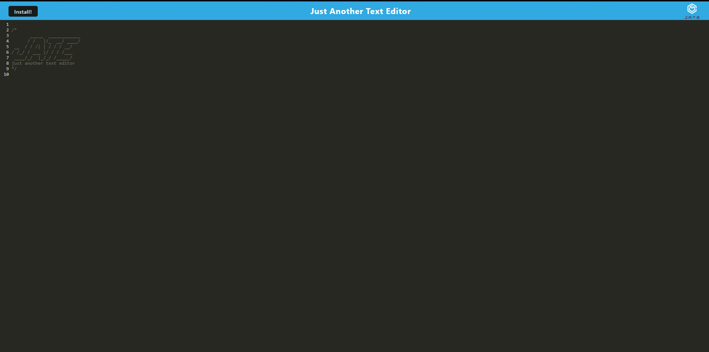

# text-editor

## Installation
The app can be installed and opened using the "install" button on the top of the page.

## Usage
Once launched, users can immediately start writing and editing text. They can choose to continue editing their text in the app within the browser, or they can choose to click the "install" button and continue writing or editing the text outside of the browser.

[GitHub Repository](https://github.com/oguerra9/text-editor)
[Heroku Deployment Link](https://text-ed1t0r.herokuapp.com/)
